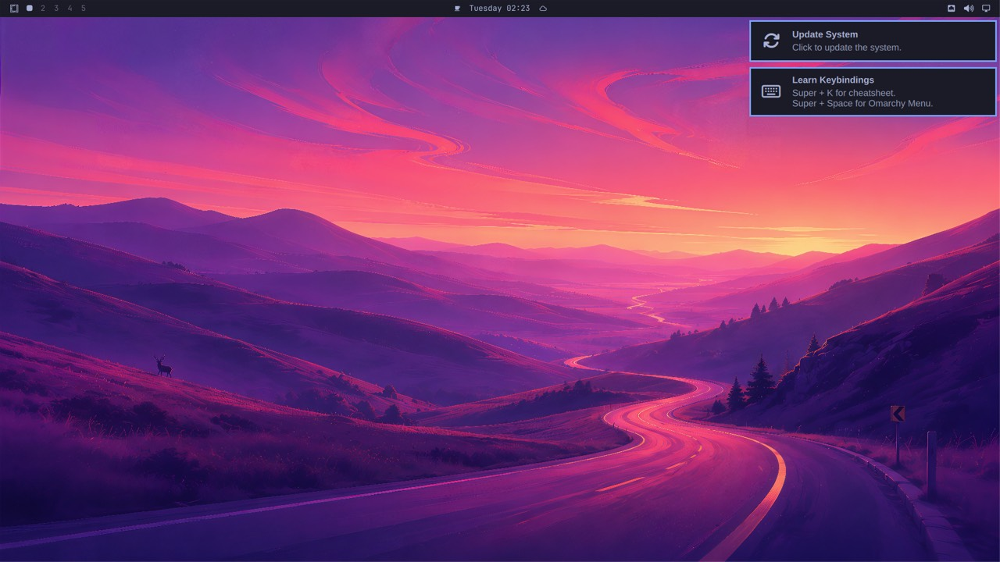

# Lab 1: The raw API

**Goal:** talk to the computer-use server with plain HTTP, take a screenshot, and see the three coordinate spaces
for one point. **Time:** 2 minutes. **Chapters:** [Seeing the screen](02-seeing-the-screen.md),
[The server](05-the-server-as-a-python-package.md).

```bash
./labs/01-the-api/run.sh
```

1. Open the port-forward and check `/status`.
2. List the windows (probably none, on a fresh desktop).
3. Take a screenshot: once as JSON, once saved as a PNG.
4. Move the mouse to the middle of the screenshot, `(640, 360)`, and read it back.
5. Ask Hyprland where the cursor is: in layout units.
6. Send three bad actions and read the errors.

## What it looks like

The screenshot from step 3: 1280x720, what an agent sees.



## Questions

**Q: The server says the cursor is at (640, 360), and Hyprland says 768, 432. Which is right?**

<details>
<summary>Answer</summary>

Both. They're the same point in different units: screenshot pixels (scaled to 1280x720) and Hyprland's layout units
(1536x864, the 1920x1080 monitor at scale 1.25). 640 / 0.833 = 768.

</details>

**Q: Why does `/status` report 1280x720 when the monitor is 1920x1080?**

<details>
<summary>Answer</summary>

The server reports the screen as agents see it. Screenshots are scaled to fit 1280x800 so Anthropic's API doesn't
shrink them again, and every coordinate in the API is in those pixels.

</details>

**Q: The errors come back as JSON with HTTP 400. Who reads them?**

<details>
<summary>Answer</summary>

The model. Through Canine they become MCP tool errors, and Claude reads "coordinate [5000, 10] is off the 1280x720
screen" and corrects itself. That's why the messages say what's wrong and what's allowed.

</details>

## Expected output

<details>
<summary>📜 Expected output (a real run, captured while writing this book)</summary>

```text
== 1. Reach the server: a kubectl port-forward to the VM's launcher pod, port 8000 inside the guest
$ echo "launcher pod: $(vm_pod)"
launcher pod: virt-launcher-omarchy-auto-9z2l7
$ cu GET /status
{"ok":true,"screen":{"width":1280,"height":720}}
   No authentication: only a port-forward (which needs cluster access) can reach it. Canine checks the user first.

== 2. What's on screen: Hyprland's windows, in screenshot pixels
$ cu GET /windows
{"windows":[]}

== 3. A screenshot: one action, the same JSON an agent's model sends
$ act '{"action": "screenshot"}'
{"image":"<1562124 base64 chars>","format":"png","width":1280,"height":720}
$ shot $LABS/out/lab1-screen.png
saved $LABS/out/lab1-screen.png (1171593 bytes)
   The monitor is 1920x1080, but the screenshot is 1280x720: scaled to fit what Anthropic's API takes without
   shrinking it again. Its pixels are the coordinates every other action takes.

== 4. Move the mouse to the middle of the screenshot (640, 360) and ask where it is
$ act '{"action": "mouse_move", "coordinate": [640, 360]}'
{}
$ act '{"action": "cursor_position"}'
{"coordinate":[640,360]}

== 5. Ask Hyprland directly: the same spot in layout units
$ vm_ssh_desktop hyprctl cursorpos
768, 432
$ vm_ssh_desktop 'hyprctl -j monitors' | jq -c '.[0] | {name, width, height, scale}'
{"name":"Virtual-1","width":1920,"height":1080,"scale":1.25}
   Three sizes for one screen: 1920x1080 monitor pixels, 1536x864 layout units (1920 / 1.25), 1280x720 screenshot
   pixels. The middle of the screenshot, (640, 360), is layout (768, 432). desktop.py converts at the edges.

== 6. Mistakes come back as errors the agent can read (HTTP 400)
$ act '{"action": "left_click", "coordinate": [5000, 10]}'
{"error":"coordinate [5000, 10] is off the 1280x720 screen"}
$ act '{"action": "fly"}'
{"error":"Unknown action 'fly'. Actions: cursor_position, double_click, hold_key, key, left_click, left_click_drag, left_mouse_down, left_mouse_up, middle_click, mouse_move, right_click, screenshot, scroll, triple_click, type, wait, zoom"}
$ act '{"action": "key"}'
{"error":"key needs text, e.g. \"Return\" or \"ctrl+a\""}

== 7. Done
$ lab_stop_forwards
port-forwards stopped
```

</details>

## Try next

- `act '{"action": "zoom", "region": [0, 0, 320, 25]}'` and save it with `shot`: the top bar at full resolution.
- `vm_ssh_desktop 'hyprctl -j clients'` with a window open, and compare `at`/`size` with `cu GET /windows`.
