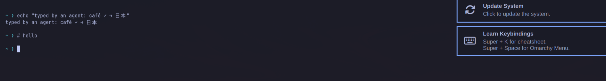

# Lab 2: Drive the desktop

**Goal:** do what an agent does: shortcuts, text, clicks, and a close look at the result. **Time:** 2 minutes.
**Chapters:** [Pressing keys and clicking](03-pressing-keys-and-clicking.md).

```bash
./labs/02-drive/run.sh
```

1. Switch to an empty workspace with `super+5`, an Omarchy shortcut sent as real key codes.
2. Open a terminal with `super+Return`, then **check it has focus** before typing anything.
3. Type a command with Unicode in it (through wtype), then press `Return`.
4. Keys by name: type `hello`, `ctrl+a` to jump to the start of the line, and comment it out.
5. Zoom into the top of the terminal to read the result.
6. Right-click in the terminal, then `Escape`.
7. Close the terminal with `super+w` and go back to workspace 1.

## What it looks like

The zoom from step 5, at the monitor's full resolution:



## Questions

**Q: Step 2 checks which window has focus before typing. What would happen without that check?**

<details>
<summary>Answer</summary>

Keys go to whatever has focus. If the terminal hadn't opened yet (or opened on another workspace), the text and
`Return` would go into whatever window was focused, maybe someone's browser. An early version of the other book's
Wayland lab did exactly that.

</details>

**Q: `café ✓ → 日本` arrived exactly, but `ctrl+a` is a key combination. Why do they go through different
mechanisms?**

<details>
<summary>Answer</summary>

Text goes through wtype, whose own keymap can hold any character. Key combinations go through the uinput keyboard as
physical key codes, which is what Omarchy's `code:` shortcuts and apps' shortcuts expect.

</details>

**Q: The zoom is 1890 pixels wide, but the region asked for was 1260 wide. Why?**

<details>
<summary>Answer</summary>

The region is in screenshot pixels (1280x720 space), but zoom captures at the monitor's full resolution (1920x1080
space): 1260 × 1.5 = 1890.

</details>

## Expected output

<details>
<summary>📜 Expected output (a real run, captured while writing this book)</summary>

```text
== 1. Switch to workspace 5 with Omarchy's shortcut: a key combination through the virtual keyboard
$ act '{"action": "key", "text": "super+5"}'
{}
$ vm_ssh_desktop 'hyprctl -j activeworkspace' | jq -c '{workspace: .id, windows}'
{"workspace":5,"windows":0}

== 2. Open a terminal (Super+Return) and find it in the window list
$ act '{"action": "key", "text": "super+Return"}'
{}
$ act '{"action": "wait", "duration": 2}'
{}
$ cu GET /windows
{"windows":[{"title":"omarchy@omarchy-auto:~","app":"foot","pid":20109,"workspace":5,"focused":true,"bounds":{"x":10,"y":32,"width":1260,"height":678}}]}
   Focused: foot. Only now is it safe to type: keys go to whatever has focus.

== 3. Type a command. Text goes through wtype, so any Unicode works, whatever the keyboard layout
$ act '{"action": "type", "text": "echo \"typed by an agent: café ✓ → 日本\""}'
{}
$ act '{"action": "key", "text": "Return"}'
{}
$ act '{"action": "wait", "duration": 1}'
{}

== 4. Keys by name (xdotool's names): type, jump to the start of the line with ctrl+a, comment it out
$ act '{"action": "type", "text": "hello"}'
{}
$ act '{"action": "key", "text": "ctrl+a"}'
{}
$ act '{"action": "type", "text": "# "}'
{}
$ act '{"action": "key", "text": "Return"}'
{}
$ act '{"action": "key", "text": "ctrl+nope"}'
{"error":"Unknown key 'nope'"}

== 5. Look closely: zoom into the top of the terminal (a region of the screen, in pixels)
$ shot $LABS/out/lab2-terminal.png 10 32 1270 202
saved $LABS/out/lab2-terminal.png (60517 bytes)
   zoom returns just that region, at full resolution: cheaper than a whole screenshot, and easier to read.

== 6. A click: right-click in the middle of the terminal (its context menu, if it has one), then Escape
$ act '{"action": "right_click", "coordinate": [640,371]}'
{}
$ act '{"action": "key", "text": "Escape"}'
{}

== 7. Close the terminal (Super+W) and go back to workspace 1
$ act '{"action": "key", "text": "super+w"}'
{}
$ act '{"action": "key", "text": "super+1"}'
{}
$ cu GET /windows
{"windows":[]}
$ lab_stop_forwards
port-forwards stopped
```

</details>

## Try next

- `act '{"action": "double_click", "coordinate": [...]}'` on a word in the terminal, then `key ctrl+shift+c`.
- `act '{"action": "left_click_drag", "start_coordinate": [...], "coordinate": [...]}'` to select text.
