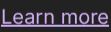

# Lab 3: The accessibility tree

**Goal:** use an app by its structure instead of its pixels: find elements by role and name, press a link without the
mouse, and check that the tree's positions are right. **Time:** 2 minutes.
**Chapters:** [The accessibility tree](04-the-accessibility-tree.md).

```bash
./labs/03-accessibility/run.sh
```

1. Open Chromium on workspace 6 (`super+shift+Return`), find its address bar by role, and fill it with `set_text`.
2. List the apps that publish a tree, and the top of Chromium's.
3. Find the page's links, and the toolbar's buttons.
4. Zoom into the bounds the tree gives for "Learn more".
5. Press the link through its accessibility action, and see the page change.
6. Press the same path again, which is now stale.
7. Close the window.

## What it looks like

Step 4's zoom into the reported bounds. If the unit conversions were wrong, this would show empty space or the
wrong words:



## Questions

**Q: `set_text` on the address bar replied `{"method": "typed"}`. What does that tell you?**

<details>
<summary>Answer</summary>

The field didn't offer AT-SPI's EditableText interface (Chromium's address bar doesn't), so the server focused it
through AT-SPI, pressed `ctrl+a` and typed over it. For a field with the interface, the reply is `"set"`.

</details>

**Q: The link reports `{"x":603,"y":434,"width":74,"height":22}`, and the Close button `{"x":1241,"y":32,...}`. One
came from device pixels and one from layout units. Which is which?**

<details>
<summary>Answer</summary>

The link is web content, reported by Chromium in device pixels. The Close button is Chromium's own UI, reported in
layout units. `accessibility.py` converts both to screenshot pixels, so they arrive in the same space.

</details>

**Q: The press reply was `"pressed": "jump"`. What's jump?**

<details>
<summary>Answer</summary>

The name of a link's action in AT-SPI (following the link). Buttons usually offer `click` or `press`. `press` picks
the first of click/press/activate/jump that the element has.

</details>

**Q: Step 2 lists three `frame`s for Chromium and a `Restore pages?` alert, but only one Chromium window is open.
Where do the others come from?**

<details>
<summary>Answer</summary>

Chromium publishes more top-level objects than it has visible windows. The alert is its "restore pages" bubble,
there because the desktop session was restarted while Chromium was open. That's one reason `find` takes an `app`
filter and returns bounds: an agent can check that what it found is on screen.

</details>

## Expected output

<details>
<summary>📜 Expected output (a real run, captured while writing this book)</summary>

```text
== 1. Open a browser window (Super+Shift+Return) on workspace 6, and load example.com through its address bar
$ act '{"action": "key", "text": "super+6"}'
{}
$ act '{"action": "key", "text": "super+shift+Return"}'
{}
$ act '{"action": "wait", "duration": 4}'
{}
{"path":"4/0/0/0/5/1/0/5/2","role":"entry","name":"Address and search bar","bounds":{"x":142,"y":74,"width":915,"height":20},"states":["focused","editable"]}
   The address bar, found by role. set_text fills it (Chromium doesn't support setting it directly, so the
   server focuses it and types over it); then Return loads the page.
$ a11y set_text '{"path":"4/0/0/0/5/1/0/5/2","text":"example.com"}'
{"method":"typed"}
$ act '{"action": "key", "text": "Return"}'
{}
$ act '{"action": "wait", "duration": 3}'
{}
$ cu GET /windows | jq -c '.windows[] | {title, app, bounds}'
{"title":"Example Domain - Chromium","app":"chromium","bounds":{"x":10,"y":32,"width":1260,"height":678}}

== 2. The apps publishing an accessibility tree, and the top of Chromium's
$ a11y tree '{"max_depth": 0}' | jq -c '[.apps[] | {path, role, name}]'
[{"path":"0","role":"application","name":"quickshell"},{"path":"1","role":"application","name":"xdg-desktop-portal-gtk"},{"path":"2","role":"application","name":"quickshell"},{"path":"3","role":"application","name":"udiskie"},{"path":"4","role":"application","name":"Chromium"}]
$ a11y tree '{"app": "chromium", "max_depth": 3}' | jq -c '.apps[0] | .. | objects | select(.role) | {path, role, name}' | head -12
{"path":"4","role":"application","name":"Chromium"}
{"path":"4/0","role":"frame","name":"Example Domain - Chromium"}
{"path":"4/0/0","role":"panel","name":""}
{"path":"4/0/0/0","role":"panel","name":""}
{"path":"4/1","role":"frame","name":""}
{"path":"4/1/0","role":"panel","name":""}
{"path":"4/1/0/0","role":"panel","name":""}
{"path":"4/2","role":"frame","name":""}
{"path":"4/2/0","role":"panel","name":""}
{"path":"4/2/0/0","role":"panel","name":""}
{"path":"4/3","role":"alert","name":"Restore pages?"}
{"path":"4/3/0","role":"panel","name":""}
   Every element has a role, a name and a path (child indexes from the desktop down).

== 3. Find the page's links, and the buttons in the browser's own toolbar
$ a11y find '{"app": "chromium", "role": "link"}' | jq -c '.elements[]'
{"path":"4/0/0/0/5/2/0/1/3/6","role":"link","name":"Learn more","bounds":{"x":603,"y":434,"width":74,"height":22},"text":"Learn more","states":[]}
$ a11y find '{"app": "chromium", "role": "button"}' | jq -c '.elements[] | {name, bounds}' | head -5
{"name":"Close","bounds":{"x":1241,"y":32,"width":29,"height":33}}
{"name":"Back","bounds":{"x":10,"y":70,"width":33,"height":28}}
{"name":"Forward","bounds":{"x":45,"y":70,"width":28,"height":28}}
{"name":"Reload","bounds":{"x":75,"y":70,"width":28,"height":28}}
{"name":"View site information","bounds":{"x":115,"y":74,"width":20,"height":20}}

== 4. Is the tree right about where things are? Zoom into the link's bounds
$ shot $LABS/out/lab3-link.png 603 434 677 456
saved $LABS/out/lab3-link.png (1982 bytes)
   The zoom should show exactly the words 'Learn more'. (Web content is reported in device pixels, the
   browser's own UI in layout units: accessibility.py handles both. Chapter 4 has the details.)

== 5. Press the link through its accessibility action: no coordinates, no mouse
$ a11y press '{"path":"4/0/0/0/5/2/0/1/3/6"}'
{"pressed":"jump"}
$ act '{"action": "wait", "duration": 3}'
{}
$ cu GET /windows | jq -c '.windows[] | {title}'
{"title":"Example Domains - Chromium"}

== 6. Paths go stale when the UI changes: the old path now points somewhere else, or nowhere
$ a11y press '{"path":"4/0/0/0/5/2/0/1/3/6"}'
{"error":"No element at 4/0/0/0/5/2/0/1/3/6 (the UI may have changed; look it up again)"}
   So agents find an element and use its path right away.

== 7. Close the window (Super+W) and go back to workspace 1
$ act '{"action": "key", "text": "super+w"}'
{}
$ act '{"action": "key", "text": "super+1"}'
{}
$ lab_stop_forwards
port-forwards stopped
```

</details>

## Try next

- `cu POST /accessibility/tree '{"app": "chromium", "max_depth": 40}' > tree.json`, then count roles with
  `jq '[.. | objects | select(.role) | .role] | group_by(.) | map({(.[0]): length}) | add' tree.json`.
- Find a web page with a form and try `set_text` on its inputs: web inputs do support EditableText.
