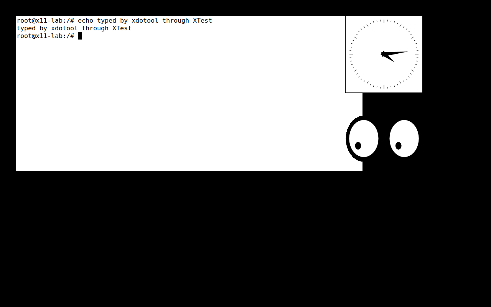

*Lab page 5 of 9*

# Lab 5: X11 playground

**Goal:** build an X11 desktop by hand and see why it's so easy to automate (and to snoop on).
**Time:** 5 minutes (1 minute of package installs). **Chapter:** [How Linux draws a desktop](04-how-linux-draws-a-desktop.md).

```bash
./labs/05-x11/run.sh
```

A plain pod (no VM) with Xvfb, a VNC server, `xterm`/`xclock`/`xeyes`, and the same tools the agent computer's
computer server uses. The script opens **macOS Screen Sharing** (`vnc://localhost:5901`, password `lab`) so you can
watch everything happen live.

1. Start **Xvfb** on `DISPLAY=:1`: an X server with no monitor. Screen Sharing shows black.
2. Start three apps (clients). `xwininfo` lists the window tree.
3. `xdotool` moves the pointer (watch `xeyes`) and types into the xterm through **XTest**.
4. Take a screenshot of the whole screen: any client can.
5. Watch every keystroke with `xinput test-xi2 --root` while `xdotool` types "secret".

## What it looks like



## Questions

**Q: Why did `xdotool windowactivate` fail in an early version of this lab, and how does the lab type into the xterm now?**

<details>
<summary>Answer</summary>

Activating a window is a window-manager feature (`_NET_ACTIVE_WINDOW`), and a bare Xvfb has no window manager. Without one, X sends keystrokes to the window under the pointer, so the lab moves the mouse over the xterm first.

</details>

**Q: The listener counted 12 raw key events for 'secret'. Why 12?**

<details>
<summary>Answer</summary>

6 letters × (press + release). Any X client can subscribe to raw input for the whole display, which is how our takeover lock's `input_watch.c` notices a person using the desktop, and also how a keylogger would work.

</details>

**Q: Selkies (the person) and xdotool (the agent) both inject input through XTest. Why is that a problem for the takeover lock?**

<details>
<summary>Answer</summary>

The events look identical, so the lock can't tell who produced them by device. It uses timing instead: events while an agent command is running (plus 0.5 s) are the agent's, anything else is a human.

</details>


## Expected output

<details>
<summary>📜 Expected output (a real run, captured while building the lab)</summary>

```text
== 1. Start the lab pod (Ubuntu + X11 tools; installing packages takes ~1 minute)
$ kubectl apply -f x11-lab.yaml
pod/x11-lab created
......... ready

== 2. Start an X server with no monitor: Xvfb draws into memory. DISPLAY=:1 is its address.
$ X 'xdpyinfo | grep -E "name of display|dimensions"'
name of display:    :1
  dimensions:    1280x800 pixels (325x203 millimeters)

== 3. Watch it: start a VNC server on the display and connect from your Mac
   Open Screen Sharing: run   open vnc://localhost:5901   (password: lab)
   It's black: an X server with no apps and no window manager is just an empty framebuffer.

== 4. Apps are clients: start a terminal, a clock and eyes that follow the mouse
$ X 'xwininfo -root -children | grep -E "xterm|xclock|xeyes"'
     0x100000a "xeyes": ("xeyes" "XEyes")  200x120+900+300  +900+300
     0xe0000c "xclock": ("xclock" "XClock")  200x200+900+40  +900+40
     0xc0000c "root@x11-lab: /": ("xterm" "XTerm")  904x404+40+40  +40+40
   xwininfo lists the window tree, a bit like document.body.children in the DOM.

== 5. Inject input through XTest, the way xdotool (our agent) and Selkies (you, in the browser) both do
$ X 'xdotool mousemove 300 200 && xdotool getmouselocation'
x:300 y:200 screen:0 window:0
   Watch xeyes look at the pointer.
$ X 'xdotool mousemove 400 200 && xdotool type --delay 60 "echo typed by xdotool through XTest" && xdotool key Return'
   Watch the xterm: the keys were injected, no keyboard involved. With no window manager running, X sends
   keystrokes to whatever window is under the pointer, which is why we moved the mouse over the xterm first.

== 6. Any client can read the whole screen (this is what the agent's screenshot command does)
$ X 'import -window root /tmp/screen.png' && kubectl cp lab/x11-lab:/tmp/screen.png /tmp/x11-lab-screen.png >/dev/null && echo saved /tmp/x11-lab-screen.png
saved /tmp/x11-lab-screen.png

== 7. Any client can watch every input event, system-wide (XInput2 raw events, like our input_watch.c)
   Listening to every input event while xdotool types "secret" into the xterm...
$ kubectl exec -n lab x11-lab -- sh -c 'grep -cE "EVENT type (13|14) " /tmp/events.txt | sed "s/^/raw key events seen: /"'
raw key events seen: 12
   13/14 = RawKeyPress/RawKeyRelease. A keylogger is 5 lines of X11 code. Wayland was designed to make this
   impossible for ordinary apps, which is why Omarchy needs compositor-specific tools instead (Lab 6).

== 8. Clean up
$ kubectl delete pod x11-lab -n lab --wait=false
pod "x11-lab" deleted
```

</details>


## Try next

- Run `DISPLAY=:1 xdotool key ctrl+c` (via `kubectl exec`) while the xterm runs `sleep 100`.
- Start `xfwm4` or `twm` (install it) and re-run step 3 with `xdotool windowactivate`: it works once there's a
  window manager.

---

← [Lab 4: Port-forward and masquerade networking](20-lab-4-port-forward.md) · [Index](README.md) · [Lab 6: Wayland and Hyprland (Omarchy)](22-lab-6-wayland.md) →
