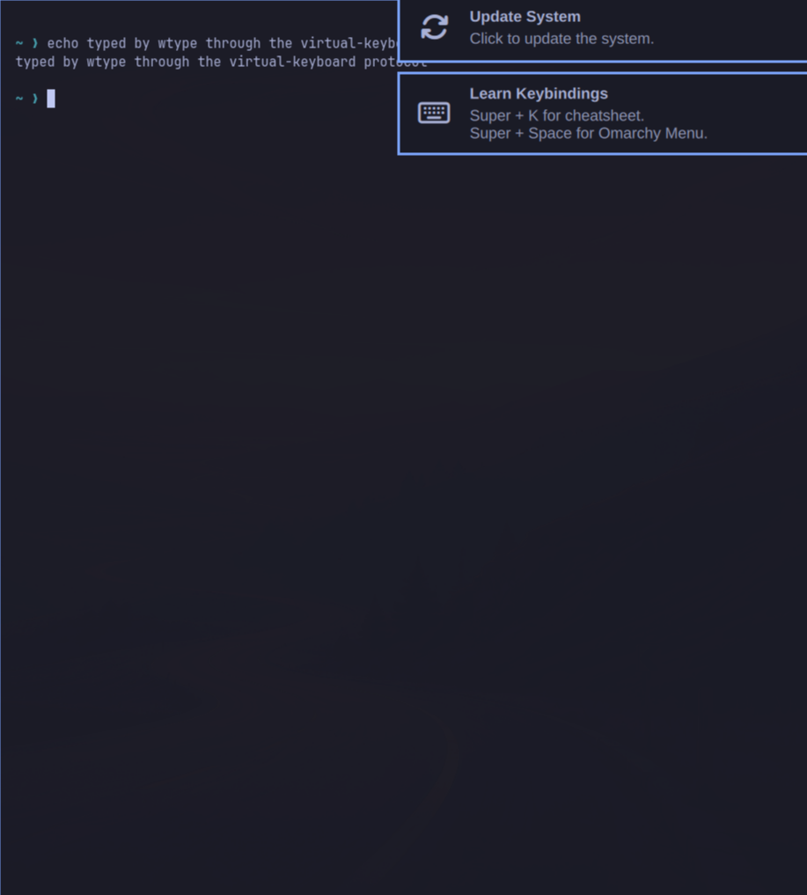

*Lab page 6 of 9*

# Lab 6: Wayland and Hyprland (Omarchy)

**Goal:** do Lab 5's tricks on a modern Wayland desktop and see what changes: you ask the compositor instead of
poking a global X server. **Time:** 3 minutes. **Chapters:** [How Linux draws a desktop](04-how-linux-draws-a-desktop.md),
[Omarchy](09-omarchy.md).

Open Omarchy's connect page in Canine (`/agent_computers/12/connect`) to watch it happen live, then:

```bash
./labs/06-wayland/run.sh
```

1. Hyprland is display server **and** window manager in one process; Selkies is a separate client of it.
2. `hyprctl monitors` / `hyprctl clients`: only the compositor knows the screen and the windows.
3. Open a terminal by asking Hyprland (`hl.dsp.exec_cmd`, the Lua-config dispatcher syntax).
4. Type into it with **wtype** (the virtual-keyboard protocol), **only after checking our window has focus**.
5. Screenshot **just that window** with **grim**.
6. Change a setting live (`hyprctl eval "hl.config({ general = { gaps_out = 60 } })"`), then `hyprctl reload`.
7. Close the lab window by its own PID.

## What it looks like



## Questions

**Q: Why can't you just use `xdotool` on Omarchy?**

<details>
<summary>Answer</summary>

xdotool speaks X11. Omarchy's desktop is a Wayland compositor. There is an X server (XWayland, display :0), but it only hosts legacy X11 apps, so X11 tools can't see or control the rest of the desktop.

</details>

**Q: wtype sends keys to 'the focused window'. Why does the lab check focus first?**

<details>
<summary>Answer</summary>

Because of what happened while building it: the window-opening command failed, and wtype typed into your Chromium instead. On a real desktop, never inject input without confirming the target has focus.

</details>

**Q: Why did `hyprctl keyword general:gaps_out 60` fail?**

<details>
<summary>Answer</summary>

Omarchy's Hyprland uses the newer Lua config ('non-legacy parser'). Live changes go through `hyprctl eval` with the same Lua you'd put in the config files.

</details>


## Expected output

<details>
<summary>📜 Expected output (a real run, captured while building the lab)</summary>

```text
== 1. Who draws the screen here? Hyprland is display server + window manager in one process
$ H 'pgrep -a Hyprland | cut -c1-80; hyprctl instances | head -4; echo selkies: $(systemctl --user is-active selkies)'
1020 Hyprland --watchdog-fd 4
instance efb50993780079460b0cbed1363e2166a2de1d9f_1790389975_1064087600:
	time: 1790389975
	pid: 1020
	wl socket: wayland-1
selkies: active
   Selkies is a separate program that asks Hyprland for frames and sends it input (--wayland-host-display).

== 2. Ask the compositor about the screen and the windows (Wayland's answer to xdpyinfo/xwininfo)
$ H 'hyprctl monitors -j | python3 -c "import json,sys; m=json.load(sys.stdin)[0]; print(m[\"name\"], m[\"width\"], \"x\", m[\"height\"], \"scale\", m[\"scale\"])"'
Virtual-1 1920 x 1080 scale 1.25
$ H 'hyprctl clients -j | python3 -c "import json,sys; [print(c[\"class\"], \"| workspace\", c[\"workspace\"][\"id\"], \"| at\", c[\"at\"], \"size\", c[\"size\"]) for ...
chromium | workspace 1 | at [27, 38] size [734, 814]
foot | workspace 1 | at [775, 38] size [734, 814]
   Only the compositor knows this. A normal Wayland app can't list other apps' windows at all.

== 3. Open a window by asking Hyprland to run a program (watch it appear in the connect page)
$ H 'hyprctl dispatch "hl.dsp.exec_cmd(\"foot --app-id lab-window\")"'
ok
$ H 'hyprctl activewindow -j | python3 -c "import json,sys; print(json.load(sys.stdin).get(\"class\",\"\"))"'
lab-window

== 4. Inject keystrokes with wtype (Wayland virtual-keyboard protocol), only into our own window
$ H 'if [ "$(hyprctl activewindow -j | python3 -c "import json,sys; print(json.load(sys.stdin).get(\"class\",\"\"))")" = lab-window ]; then wtype "echo typed by wtype ...
typed
   Keystrokes always go to the focused window, which is why the lab checks focus first. xdotool doesn't work
   here: it speaks X11, and Hyprland only runs XWayland (display :0) for old X apps, not for the whole desktop.

== 5. Screenshot just that window with grim (wlroots screencopy protocol, which Selkies uses too)
$ H 'g=$(hyprctl clients -j | python3 -c "import json,sys; c=[c for c in json.load(sys.stdin) if c[\"class\"]==\"lab-window\"][0]; print(f\"{c[\"at\"][0]},{c[\"at\"][1...
captured 790,38 734x814
   saved /tmp/lab-window.png

== 6. Change a setting live through Hyprland's Lua config API, then put it back
$ H 'hyprctl eval "hl.config({ general = { gaps_out = 60 } })" >/dev/null; hyprctl getoption general:gaps_out | head -1'
css gap data: 60 60 60 60
   Look at the connect page: big gaps around the windows.
$ H 'hyprctl reload >/dev/null; sleep 1; hyprctl getoption general:gaps_out | head -1'
css gap data: 10 10 10 10
   reload re-reads ~/.config/hypr/*.lua. That's how we made our changes permanent: scale 1.25, no animations,
   invisible cursor. Try:  H 'grep -A8 "Streamed through Selkies" ~/.config/hypr/looknfeel.lua'

== 7. Close the lab window (by its own PID, so nothing else can be hit)
$ H 'kill $(hyprctl clients -j | python3 -c "import json,sys; print(\" \".join(str(c[\"pid\"]) for c in json.load(sys.stdin) if c[\"class\"]==\"lab-window\"))") && ech...
closed
```

</details>


## Try next

- `omarchy_ssh 'cat ~/.config/hypr/looknfeel.lua | tail -20'` to see the permanent changes we made (cursor,
  animations, blur, shadows) and `cat ~/.config/hypr/monitors.lua` for the scale.
- `omarchy_ssh 'ls /tmp/.X11-unix/'`: `X0` is XWayland, the X11 server Hyprland runs for old X apps only.

---

← [Lab 5: X11 playground](21-lab-5-x11.md) · [Index](README.md) · [Lab 7: Selkies up close](23-lab-7-selkies.md) →
